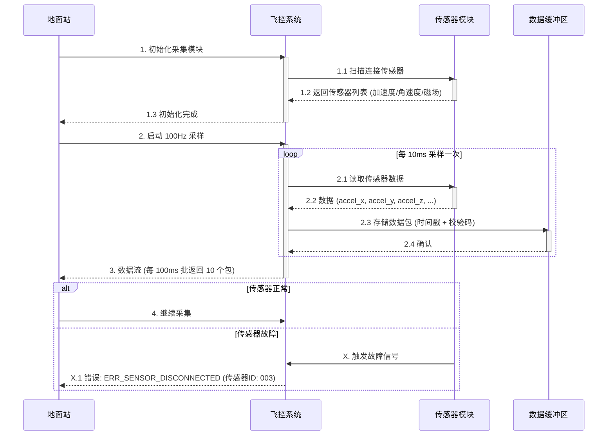

# 需求卡片：飞控数据采集接口

## 基本信息

| 字段 | 值 |
|------|------|
| **需求编号** | REQ-2026-03-001 |
| **名称** | 飞控数据采集接口 |
| **提出人** | 航电软件客户 |
| **优先级** | P0 |
| **状态** | 草稿 |
| **创建时间** | 2026-03-31 |

## 功能目标

飞控系统需要采集来自多个传感器的实时数据，包括加速度、角速度和磁场等。系统应支持 100Hz 高频采样、1000+ 数据点批处理、256 并发连接，响应时间控制在 200ms 以内，同时确保数据的可追溯性和故障透明化。

## 优先级推荐理由

**识别关键词：** "必须"、"需要"、"支持"、"应支持"
- 数据采集是飞控系统的核心功能（命脉级）
- 包含硬性要求：100Hz 采样率、200ms 响应时间（SLA）
- 影响系统整体稳定性（256 并发）
**推荐等级：P0**（必须在此版本实现）

## 用户场景

### 场景信息

| 元素 | 描述 |
|------|------|
| **角色** | 飞控系统工程师 / 地面站操作员 |
| **前置条件** | 飞控系统已启动，传感器硬件已连接并通电 |
| **操作步骤** | 1. 初始化数据采集模块 2. 配置采样参数（频率、数据类型） 3. 建立传感器连接 4. 启动实时采集 5. 接收数据并存储/处理 6. 监控采集状态 |
| **预期结果** | 系统稳定采集传感器数据，每 10ms 返回一个数据包，包含时间戳、传感器 ID、数据值和校验码；若传感器断开，立即返回"ERR_SENSOR_DISCONNECTED"错误 |

### 时序图

## 验收标准

### 标准 1：单次采集延迟
**Given** 传感器已连接，系统处于采集模式
**When** 发起一次数据采集请求（包含 1000 个数据点）
**Then** 系统应在 200ms 内返回完整数据包，包含时间戳、传感器 ID、数据值

### 标准 2：并发连接支持
**Given** 系统已初始化
**When** 同时建立 256 个数据采集连接
**Then** 所有连接均成功建立，并发连接数不低于 256，单个连接的响应时间不超过 200ms

### 标准 3：数据完整性
**Given** 采集过程中，传感器数据流包含加速度、角速度、磁场三类数据
**When** 采样周期为 100Hz，持续采集 1 秒
**Then** 应获得 100 个完整数据点（允许丢包率 ≤1%），每个数据点包含时间戳、传感器 ID、数据值

### 标准 4：故障处理
**Given** 采集过程中，任一传感器断开连接
**When** 故障发生
**Then** 系统应在 50ms 内检测故障，并返回明确的错误信息，包含故障传感器 ID 和故障类型代码

### 标准 5：数据追溯性
**Given** 采集周期为 100Hz，每 10ms 采样一次
**When** 采样完成
**Then** 每个数据点均包含准确的时间戳（精度 ≥ 1ms），支持数据与事件时序对齐

## 约束和非功能需求

| 类别 | 要求 |
|------|------|
| **性能** | 采样率: 100Hz (±2%) 响应时间: ≤200ms 吞吐量: ≥1000 数据点/批次 并发连接: ≥256 |
| **可靠性** | 传感器故障检测: ≤50ms 数据丢包率: ≤1% 连接稳定性: 24h 无丢失 |
| **安全性** | 数据包包含校验码 (CRC32) 传感器 ID 认证 采集日志加密存储 |
| **兼容性** | 支持加速度、角速度、磁场三种传感器 向后兼容 v1.x 采集格式 |

## 设计决策

### 1. 时序图中为何分离"传感器模块"和"数据缓冲区"？
- 明确责任划分：传感器模块负责硬件读取，缓冲区负责数据持久化
- 便于性能优化：缓冲区可独立调优，不影响采样速率

### 2. 为何验收标准 2 限制在 256 并发？
- 硬件约束：飞控系统通常有固定数量的硬件接口（SPI/I2C）
- 系统设计基准：256 是 8-bit 地址空间上限，便于 ID 管理

### 3. 故障检测 50ms 是否过紧？
- 基于 100Hz 采样率的 5 个周期（10ms/周期），允许多轮检测确认
- 留有调试空间：实现时可通过可配置参数调整

## 相关需求

- 关联需求：REQ-2026-03-003（传感器故障自动诊断）
- 依赖模块：电源管理（REQ-2026-03-002）

## 审核记录

| 日期 | 审核人 | 意见 |
|------|--------|------|
| 2026-03-31 | AI Structurizer | 初稿生成，通过格式验证 |
| - | 需求评审 | 待人工审核 |
