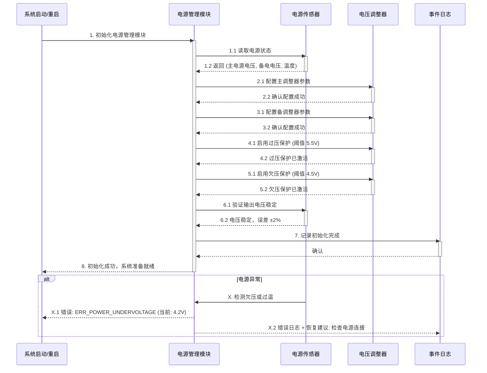

# 需求卡片：电源管理模块初始化

## 基本信息

| 字段 | 值 |
|------|------|
| **需求编号** | REQ-2026-03-002 |
| **名称** | 电源管理模块初始化 |
| **提出人** | 航电软件客户 |
| **优先级** | P0 |
| **状态** | 草稿 |
| **创建时间** | 2026-03-31 |

## 功能目标

电源管理模块在系统启动时进行初始化操作，包括检测电源状态、配置电压调整器和启用过压保护。初始化过程应在 100ms 内完成，若失败应输出详细的错误码和恢复建议。系统应支持热重启，无需关闭整个飞控系统即可重启电源管理模块。

## 优先级推荐理由

**识别关键词：** "需要"、"应在"、"支持"
- 电源管理是飞控系统的基础设施（命脉级，影响全局可用性）
- 包含硬性 SLA：初始化 ≤100ms
- 支持热重启增加系统灵活性，提升用户体验
**推荐等级：P0**（必须在此版本实现）

## 用户场景

### 场景信息

| 元素 | 描述 |
|------|------|
| **角色** | 系统集成工程师 / 硬件维护人员 |
| **前置条件** | 飞控系统电源接入，硬件自检已通过 |
| **操作步骤** | 1. 触发电源管理模块初始化 2. 检测电源状态（主电源 + 备电） 3. 配置电压调整器参数 4. 启用过压/欠压保护 5. 验证初始化结果 6. 返回初始化状态报告 |
| **预期结果** | 电源管理模块在 100ms 内完成初始化，所有电压调整器输出正常，过压保护已激活，系统准备就绪；若失败，返回错误码和恢复步骤 |

### 时序图

## 验收标准

### 标准 1：初始化耗时
**Given** 飞控系统刚启动，电源硬件已就绪
**When** 触发电源管理模块初始化
**Then** 初始化过程在 100ms 内完成（精度 ±10%），返回初始化成功标志

### 标准 2：电源状态检测
**Given** 系统正常运行，主电源和备电均接入
**When** 初始化过程执行电源状态检测
**Then** 系统能准确读取主电源电压、备电电压和模块温度，误差 ≤2%

### 标准 3：电压调整器配置
**Given** 初始化过程中，电压调整器处于未配置状态
**When** 执行调整器配置（包括输出电压、电流限制等）
**Then** 所有调整器配置生效，输出电压稳定在目标值（±2%），配置操作在 30ms 内完成

### 标准 4：过压保护启用
**Given** 初始化过程中，过压保护未激活
**When** 启用过压保护（阈值 5.5V）
**Then** 过压保护成功激活，当输入超过阈值时自动切断或限流，保护触发时间 ≤1ms

### 标准 5：热重启支持
**Given** 系统已运行 ≥1 小时，电源管理模块已初始化
**When** 触发电源管理模块的热重启指令（不关闭系统其他部分）
**Then** 模块在 100ms 内重新初始化完成，现有电源输出不中断，重启过程中其他模块可继续运行

### 标准 6：错误码和恢复建议
**Given** 初始化过程中，某个步骤失败（如电压异常）
**When** 检测到故障条件
**Then** 返回明确的错误码（如 ERR_POWER_UNDERVOLTAGE），并输出人类可读的恢复建议（如"请检查电源连接是否良好"）

## 约束和非功能需求

| 类别 | 要求 |
|------|------|
| **性能** | 初始化耗时: ≤100ms 状态检测: ≤10ms 调整器配置: ≤30ms 热重启恢复: ≤100ms |
| **可靠性** | 初始化成功率: ≥99.9% 电压稳定度: ±2% 电源故障自动切换: ≤5ms |
| **安全性** | 过压/欠压/过温保护必须激活 电源操作必须记录日志 错误码和日志不可被删除 |
| **兼容性** | 支持多种电压调整器型号 向后兼容 v1.x 电源管理参数 |

## 设计决策

### 1. 为何时序图中分离"主调整器"和"备调整器"？
- 航电系统通常有多冗余设计，主备电路需分开初始化
- 便于故障定位：若主调整器失败，可自动切换到备调整器

### 2. 100ms 的初始化耗时是否足够？
- 基于硬件约束：通常 I2C/SPI 配置 50-80ms，留 20ms 容错
- 如需优化，可并行执行独立的初始化步骤

### 3. 热重启与冷启动的差异？
- 冷启动：完整的上电自检和配置（可能需要 500ms）
- 热重启：跳过硬件自检，仅重新配置寄存器（100ms 目标）

## 相关需求

- 关联需求：REQ-2026-03-001（飞控数据采集接口依赖电源稳定）
- 关联需求：REQ-2026-03-003（故障诊断中包含电源故障类型）

## 审核记录

| 日期 | 审核人 | 意见 |
|------|--------|------|
| 2026-03-31 | AI Structurizer | 初稿生成，通过格式验证 |
| - | 需求评审 | 待人工审核 |
