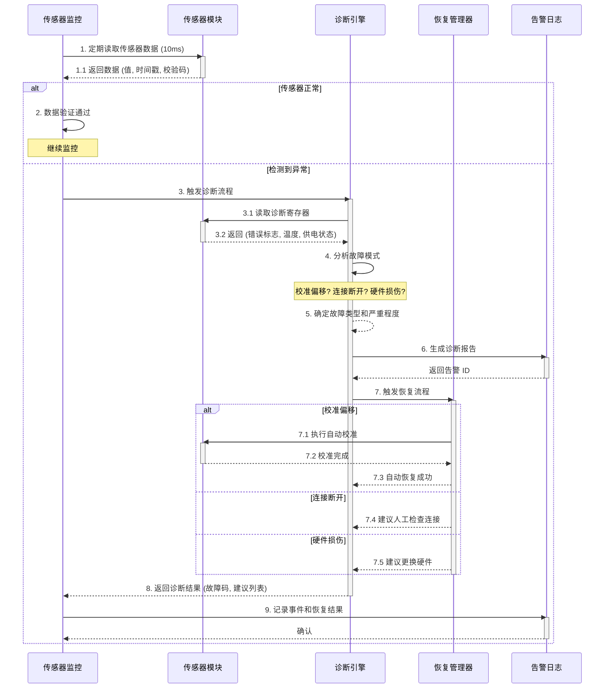

# 需求卡片：传感器故障自动诊断

## 基本信息

| 字段 | 值 |
|------|------|
| **需求编号** | REQ-2026-03-003 |
| **名称** | 传感器故障自动诊断 |
| **提出人** | 航电软件客户 |
| **优先级** | P0 |
| **状态** | 草稿 |
| **创建时间** | 2026-03-31 |

## 功能目标

当任何传感器检测到故障信号时，系统应在 50ms 内诊断故障原因（校准偏移、连接断开或硬件损伤），并根据故障严重程度输出相应的告警。诊断结果应包含恢复建议（重新校准、重连或更换硬件），支持人工和自动化两种恢复流程。

## 优先级推荐理由

**识别关键词：** "应在"、"应包含"、"支持"
- 故障诊断是安全关键系统的必备功能（影响飞行安全）
- 包含硬性 SLA：50ms 诊断时间
- 与 REQ-001（数据采集）和 REQ-002（电源管理）紧密关联，形成完整的健康检查体系
**推荐等级：P0**（必须在此版本实现）

## 用户场景

### 场景信息

| 元素 | 描述 |
|------|------|
| **角色** | 飞控系统维护工程师 / 自动化恢复系统 |
| **前置条件** | 系统运行中，传感器在线且工作正常 |
| **操作步骤** | 1. 监控传感器工作状态（心跳信号） 2. 检测异常信号（断连/异常值/超限） 3. 执行快速诊断（数据一致性检查） 4. 分析故障根因（校准偏移 vs 硬件故障） 5. 生成诊断报告和恢复建议 6. 发送告警（警告/危险级别） 7. 启动恢复流程（自动或手动） |
| **预期结果** | 系统在 50ms 内识别故障传感器及故障类型，输出包含故障代码、诊断文本和 3 条恢复建议的告警；若故障可自动恢复（校准偏移），系统自动执行；若为硬件故障，通知运维并隔离故障传感器 |

### 时序图

## 验收标准

### 标准 1：诊断耗时
**Given** 系统运行中，任一传感器报告故障
**When** 故障信号到达诊断引擎
**Then** 诊断过程在 50ms 内完成，返回故障类型和恢复建议

### 标准 2：故障类型识别
**Given** 诊断引擎收到传感器故障信号
**When** 执行根因分析
**Then** 能准确识别三类故障：(a) 校准偏移（数据异常但连接正常），(b) 连接断开（心跳丢失），(c) 硬件损伤（诊断寄存器标志异常），准确率 ≥95%

### 标准 3：告警内容完整性
**Given** 诊断完成，发出告警
**When** 告警消息被生成
**Then** 告警包含：故障代码（如 ERR_SENSOR_CALIB_OFFSET）、诊断文本（中文）、严重程度（警告/危险）、建议列表（≥3 条）、时间戳

### 标准 4：严重程度分类
**Given** 不同类型的故障
**When** 生成告警
**Then** 分类合理：校准偏移=警告级（可继续运行），连接断开=危险级（可切换备用传感器），硬件损伤=严重级（必须停飞）

### 标准 5：自动恢复（校准偏移）
**Given** 诊断结果为"校准偏移"
**When** 启动自动恢复流程
**Then** 系统自动执行传感器校准操作，在 200ms 内恢复正常，恢复失败则报告"ERR_CALIB_FAILED"

### 标准 6：人工恢复建议
**Given** 诊断结果为"连接断开"或"硬件损伤"
**When** 生成恢复建议
**Then** 提供至少 3 条明确的恢复步骤，例如：
- 连接断开：①检查传感器电源；②检查数据线连接；③重启传感器模块
- 硬件损伤：①停止使用该传感器；②更换硬件；③更新配置表

### 标准 7：隔离和故障转移
**Given** 故障传感器已诊断确认（硬件问题）
**When** 恢复流程执行
**Then** 系统自动隔离该传感器，切换到备用传感器（若可用），确保系统可继续运行，向后续模块提供降级服务

## 约束和非功能需求

| 类别 | 要求 |
|------|------|
| **性能** | 诊断耗时: ≤50ms 故障识别准确率: ≥95% 自动恢复耗时: ≤200ms 告警延迟: ≤100ms |
| **可靠性** | 诊断不遗漏故障（灵敏度 ≥99%） 误报率 ≤1% 诊断过程不影响数据采集 |
| **安全性** | 诊断日志不可篡改（签名存储） 支持故障恢复审计 硬件级故障必须产生不可逆日志 |
| **用户体验** | 告警文本清晰易懂（中文） 建议操作可执行（含具体步骤） 支持远程诊断接口 |

## 设计决策

### 1. 为何诊断耗时定为 50ms？
- 基于 100Hz 采样率的 5 个周期（10ms/周期），允许 5 轮数据确认
- 留有余量应对网络延迟（如远程诊断）
- 与数据采集接口的故障检测时间（REQ-001）对齐

### 2. 为何分为三类故障，不能更细粒度？
- 三类对应三种修复方式（软件/硬件/更换），用户可直接行动
- 更细粒度诊断（如 I2C 时序抖动）需要专用设备，超出该需求范围
- 可作为未来的 P1/P2 优化方向

### 3. 自动恢复为何仅限校准偏移？
- 校准是幂等操作，多次执行无害，失败无风险
- 连接断开和硬件损伤不可自动修复，自动化尝试会浪费时间
- 遵循"fail-fast"原则

## 相关需求

- 依赖需求：REQ-2026-03-001（数据采集），REQ-2026-03-002（电源管理）
- 被依赖需求：（后续 E3 编译验证会依赖诊断错误代码）

## 审核记录

| 日期 | 审核人 | 意见 |
|------|--------|------|
| 2026-03-31 | AI Structurizer | 初稿生成，通过格式验证 |
| - | 需求评审 | 待人工审核 |
