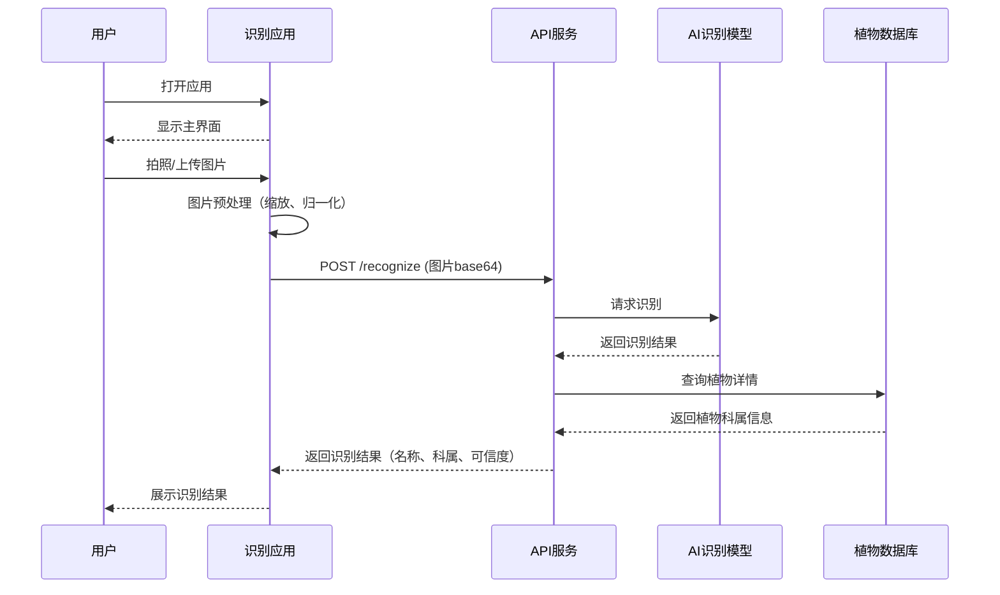

## 需求卡片：REQ-2026-04-001

| 字段   | 内容             |
| ------ | ---------------- |
| 编号   | REQ-2026-04-001  |
| 名称   | 图片植物品类识别 |
| 提出人 | 待指定           |
| 优先级 | P1（重要）       |
| 状态   | 草稿             |

### 功能目标

实现基于图片识别植物品类的功能，用户上传植物图片后，系统自动识别植物所属的科/属/种，并返回植物名称、科属分类、相似度 confidence score 等信息，支持常见园林植物、花卉、树木的识别。

### 用户场景

**角色：** 植物爱好者、园林养护人员、学生

**前置条件：** 用户已打开植物识别应用或小程序，已授权相机/相册权限，当前处于待识别状态。

**操作步骤：**

1. 用户打开植物识别应用
2. 用户选择拍照或从相册上传植物图片
3. 系统上传图片并进行 AI 识别分析
4. 系统展示识别结果（植物名称、科属、可信度）

**预期结果：** 系统返回识别结果，植物名称准确率 ≥85%，识别耗时 ≤3 秒，展示植物图片和识别信息。

### 交互流程



### 验收标准

1. **Given** 用户已授权相机权限 **When** 用户拍摄植物图片并上传 **Then** 系统在 3 秒内完成识别并返回结果

2. **Given** 用户上传清晰的植物图片 **When** 识别完成 **Then** 返回的植物名称准确率 ≥85%

3. **Given** 识别完成 **When** 系统展示结果 **Then** 显示植物名称、科属分类、confidence score（可信度百分比）

4. **Given** 网络断开 **When** 用户尝试上传图片识别 **Then** 系统提示"网络连接失败，请检查网络后重试"

5. **Given** 用户上传非植物图片 **When** 识别完成 **Then** 系统返回"未识别到植物，请上传包含植物的图片"

### 约束条件

- 识别耗时 ≤3 秒（自图片上传完成计算）
- 植物名称准确率 ≥85%
- 支持图片格式：JPG、PNG、JPEG
- 单张图片大小 ≤10MB
- 支持常见园林植物、花卉、树木 ≥1000 种

### 接口定义

```typescript
// 植物识别请求接口
interface RecognizeRequest {
  image: string // 图片 base64 编码
  thumbnail?: boolean // 是否返回缩略图
}

// 植物识别响应接口
interface RecognizeResponse {
  success: boolean
  data?: {
    name: string // 植物名称
    scientificName: string // 学名
    family: string // 科
    genus: string // 属
    confidence: number // 可信度 0-1
    description?: string // 简要描述
  }
  error?: {
    code: string
    message: string
  }
}
```
