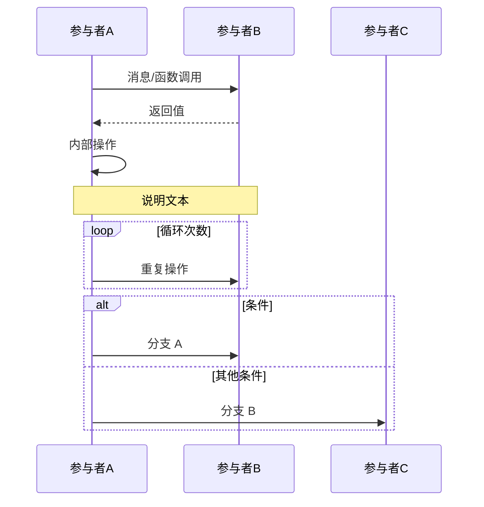
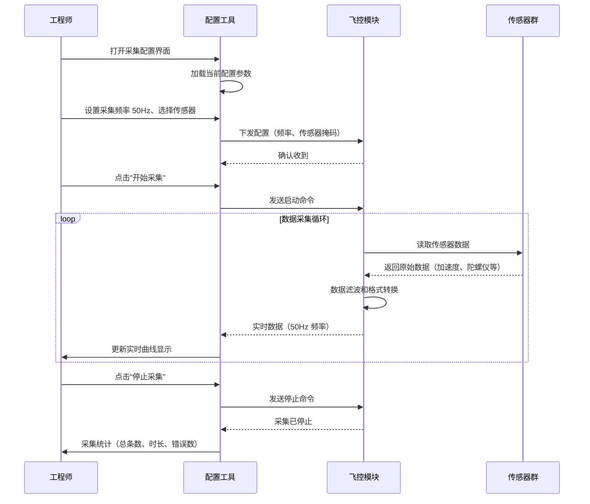

# 需求结构化 Skill

> **场景：** 将自然语言需求转换为标准化的结构化需求卡片
> **输入：** 单条或批量（5-10 条）自然语言需求文本
> **输出：** JSON 需求卡片集合（后处理为 Markdown 格式）
> **关键能力：** JSON Schema 约束 + 自动编号 + 优先级推荐 + 时序图生成

---

## 概述

本 Skill 定义了需求结构化的核心规范，包括：
1. **需求卡片 JSON Schema** - 完整的字段约束和类型定义
2. **字段详细说明** - 每个字段的格式、约束、生成规则、示例
3. **生成规范** - 需求编号递增、优先级推荐、时序图格式、验收标准编写
4. **批处理指令** - 5-10 条需求的批量处理方式
5. **评审标准** - 输出卡片的质量检查清单

---

## 需求卡片 JSON Schema 定义

### 完整 JSON Schema

```json
{
  "$schema": "http://json-schema.org/draft-07/schema#",
  "type": "array",
  "title": "需求卡片集合",
  "description": "一个或多个结构化需求卡片",
  "items": {
    "type": "object",
    "properties": {
      "req_id": {
        "type": "string",
        "pattern": "^REQ-\\d{4}-\\d{2}-\\d{3}$",
        "description": "需求编号，格式 REQ-YYYY-MM-NNN，系统自动递增生成"
      },
      "name": {
        "type": "string",
        "maxLength": 30,
        "minLength": 1,
        "description": "需求名称，不超过 30 字，简明扼要"
      },
      "author": {
        "type": "string",
        "description": "提出人，从输入上下文提取或手动填写"
      },
      "priority": {
        "enum": ["P0", "P1", "P2", "P3"],
        "description": "优先级，AI 推荐并标注理由，人工可修改"
      },
      "status": {
        "enum": ["草稿", "已确认", "开发中", "已完成"],
        "default": "草稿",
        "description": "需求状态，初始为'草稿'"
      },
      "objective": {
        "type": "string",
        "minLength": 10,
        "description": "功能目标，自然语言描述（一段话说清楚要做什么）"
      },
      "user_scenario": {
        "type": "object",
        "properties": {
          "role": {
            "type": "string",
            "description": "用户角色（例：'飞控系统工程师'、'地面站操作员'）"
          },
          "precondition": {
            "type": "string",
            "description": "前置条件（系统的初始状态）"
          },
          "steps": {
            "type": "array",
            "items": {
              "type": "string"
            },
            "minItems": 2,
            "description": "操作步骤列表（至少 2 步，每一步是一句动词+宾语）"
          },
          "expected_result": {
            "type": "string",
            "description": "预期结果（系统应该达到的状态）"
          }
        },
        "required": ["role", "precondition", "steps", "expected_result"],
        "description": "用户场景（四要素结构）"
      },
      "sequence_diagram": {
        "type": "string",
        "description": "交互流程，Mermaid 时序图代码（必须包含参与者、消息、返回）"
      },
      "acceptance_criteria": {
        "type": "array",
        "items": {
          "type": "string"
        },
        "minItems": 3,
        "description": "验收标准，至少 3 条，格式 'Given...When...Then'"
      },
      "constraints": {
        "type": "string",
        "description": "约束条件，包括性能、安全、合规等（可选）"
      },
      "interface_def": {
        "type": "string",
        "description": "接口定义，可选。函数签名或 API 描述"
      }
    },
    "required": [
      "req_id",
      "name",
      "priority",
      "objective",
      "user_scenario",
      "sequence_diagram",
      "acceptance_criteria"
    ],
    "additionalProperties": false
  }
}
```

---

## 字段详细说明

### 1. req_id（需求编号）

**类型：** `string`
**格式约束：** `REQ-YYYY-MM-NNN` (正则：`^REQ-\d{4}-\d{2}-\d{3}$`)
**说明：** 需求的唯一标识符，由系统自动生成。

**生成规则：**
- `YYYY`：生成年份（4 位）
- `MM`：生成月份（2 位，01-12）
- `NNN`：当前月份的序列号（3 位，从 001 开始递增）
  - 例：2026 年 3 月的第 1 个需求 → `REQ-2026-03-001`
  - 例：2026 年 3 月的第 15 个需求 → `REQ-2026-03-015`
  - 例：2026 年 4 月的第 1 个需求 → `REQ-2026-04-001`

**逻辑：**
1. LLM 自动生成时，读取当前日期
2. 若输入中已包含 req_id，LLM 不修改，直接保留
3. 若批量处理多条需求，编号自动递增（序列号累加）

**示例：**
```json
{
  "req_id": "REQ-2026-03-001"
}
```

---

### 2. name（需求名称）

**类型：** `string`
**约束：**
- 最大长度：30 字
- 最小长度：1 字
- 必须为中文或英文，不允许纯符号

**说明：** 需求的简洁标题，一眼能看懂做什么。

**生成规则：**
- 从自然语言需求中提取核心动词 + 宾语
- 如果超过 30 字，截断并在末尾添加省略号（保留 30 字以内）
- 避免过于宽泛（如"系统改进"），要具体（如"飞控数据采集接口")

**示例：**
```
✓ 飞控数据采集接口
✓ 用户权限管理系统
✓ 编译错误自动修复（3轮限制）

✗ 系统改进（太宽泛）
✗ 做一些工作（无意义）
```

**JSON 示例：**
```json
{
  "name": "飞控数据采集接口"
}
```

---

### 3. author（提出人）

**类型：** `string`
**说明：** 需求的提出者/客户方联系人。

**生成规则：**
- 从输入上下文提取（如果用户指定了名字或组织）
- 若无明确指定，默认填写 "待指定" 或提示用户补充
- 不填写时，可空字符串

**示例：**
```json
{
  "author": "航电软件研发部"
}
```

---

### 4. priority（优先级）

**类型：** `enum`
**可选值：** `["P0", "P1", "P2", "P3"]`

**说明：** 需求的紧急度和重要程度，AI 推荐后可人工修改。

**优先级定义：**

| 级别 | 说明 | 示例关键词 |
|------|------|----------|
| **P0** | 紧急、关键，需立即开发 | 必须、关键、核心、影响系统可用性、安全隐患 |
| **P1** | 重要、计划内，近期开发 | 重要、主要功能、用户主诉求 |
| **P2** | 一般，中期排期 | 优化、改进、增强 |
| **P3** | 低优先级，后续考虑 | 可选、讨论、未来计划 |

**AI 推荐规则：**
1. **关键词匹配** - 扫描需求文本，匹配上表中的关键词
2. **影响范围** - 若涉及系统可用性、安全性、合规性 → P0
3. **功能重要性** - 若是核心功能、主流程 → P1/P2
4. **标注理由** - 在推荐优先级时，注明 **"理由：..."** （可作为注释或额外字段）

**示例：**
```json
{
  "priority": "P0",
  "priority_reason": "涉及飞控系统安全，影响核心功能可用性"
}
```

---

### 5. status（需求状态）

**类型：** `enum`
**可选值：** `["草稿", "已确认", "开发中", "已完成"]`
**默认值：** `"草稿"`

**说明：** 需求的当前生命周期状态。

**状态定义：**

| 状态 | 说明 | 触发条件 |
|------|------|---------|
| **草稿** | 需求新生成，未评审 | 自动生成时的初始状态 |
| **已确认** | 需求已通过评审，可开发 | 手工标记（通常在评审会后） |
| **开发中** | 需求正在开发 | 开发团队标记 |
| **已完成** | 需求已开发完成，通过测试 | 测试通过后标记 |

**AI 生成规则：**
- 自动生成的卡片**始终设置为"草稿"**
- 不推断或自动更新状态
- 状态变更由人工或关联工具决定

**示例：**
```json
{
  "status": "草稿"
}
```

---

### 6. objective（功能目标）

**类型：** `string`
**约束：** 最小长度 10 字
**说明：** 用自然语言简洁描述"要做什么"，是需求的核心功能陈述。

**生成规则：**
- 一段话（2-3 句），包括：
  - 做什么（系统行为）
  - 为了什么（用户价值）
  - 预期效果（定量或定性）
- 避免：宽泛、模糊、缺乏可操作性

**示例：**
```
✓ 实现飞控数据采集接口，支持实时采集传感器数据（加速度、陀螺仪、磁力计），
  采集频率可配（10-100Hz），数据通过 CAN 总线或网络接口输出，
  精度不低于原始硬件精度，延迟控制在 50ms 以内。

✗ 改进系统的数据采集能力。
```

**JSON 示例：**
```json
{
  "objective": "实现飞控数据采集接口，支持实时采集传感器数据（加速度、陀螺仪、磁力计），采集频率可配（10-100Hz），数据通过 CAN 总线或网络接口输出，精度不低于原始硬件精度，延迟控制在 50ms 以内。"
}
```

---

### 7. user_scenario（用户场景）

**类型：** `object`（四要素结构）
**必需字段：** `role`, `precondition`, `steps`, `expected_result`

**说明：** 用 BDD 格式（Given-When-Then 演化）描述用户如何使用功能。

#### 7.1 role（用户角色）

**类型：** `string`
**说明：** 谁在使用这个功能（角色名）。

**示例：**
```
- 飞控系统工程师
- 地面站操作员
- 系统管理员
- 嵌入式开发者
```

#### 7.2 precondition（前置条件）

**类型：** `string`
**说明：** 用户开始操作之前，系统/环境的初始状态。

**生成规则：**
- 说明系统已初始化的状态
- 已具备的权限、数据、连接
- 系统参数配置情况

**示例：**
```
✓ 系统已启动，飞控模块已初始化，传感器已连接并自检通过，
  当前处于待命状态，尚未开始数据采集。

✓ 用户已登录，具有管理员权限，需求库已导入，
  当前有 20+ 条需求待审核。
```

#### 7.3 steps（操作步骤）

**类型：** `array[string]`
**约束：** 最少 2 步，每一步是一句清晰的动作陈述
**说明：** 用户操作的步骤序列，有序列表，每步一条。

**格式要求：**
- 格式：`<步骤数>. <主语>+<动词>+<宾语>+<方式/参数>`
- 每一步应该是原子操作（不能再分解）
- 使用第三人称（"用户点击..." 而不是 "你点击..."）

**示例：**
```
1. 飞控系统工程师打开飞控配置工具
2. 选择"数据采集"菜单，进入采集参数配置界面
3. 设置采集频率为 50Hz，选择要采集的传感器（加速度计、陀螺仪）
4. 点击"开始采集"按钮，系统开始采集数据
5. 工程师监控实时数据曲线，验证数据合理性
```

#### 7.4 expected_result（预期结果）

**类型：** `string`
**说明：** 完成所有步骤后，系统应该达到的终态（结果、输出、状态变化）。

**生成规则：**
- 描述系统的最终状态（成功态）
- 可含量化指标（如"数据采集频率实际 ≥ 50Hz"）
- 数据输出、界面变化、日志记录等

**示例：**
```
✓ 系统进入采集状态，显示"采集中..."，
  实时曲线开始更新，每秒更新频率 ≥ 50Hz，
  采集的数据写入本地缓存和 CAN 总线，
  用户可观测原始和滤波后的数据曲线。

✓ 20+ 条需求全部加载显示在审核列表，
  每条需求展示卡片信息（编号、名称、优先级、提出人），
  用户可进行筛选、排序、批量审核操作。
```

**完整 user_scenario 示例：**

```json
{
  "user_scenario": {
    "role": "飞控系统工程师",
    "precondition": "系统已启动，飞控模块已初始化，传感器已连接并自检通过，当前处于待命状态。",
    "steps": [
      "工程师打开飞控配置工具",
      "选择'数据采集'菜单，进入采集参数配置界面",
      "设置采集频率为 50Hz，选择传感器（加速度计、陀螺仪）",
      "点击'开始采集'按钮，系统开始采集数据"
    ],
    "expected_result": "系统进入采集状态，显示'采集中...'，实时数据曲线以 ≥50Hz 频率更新，采集数据写入本地缓存和 CAN 总线。"
  }
}
```

---

### 8. sequence_diagram（交互流程）

**类型：** `string`
**说明：** 用 Mermaid 时序图代码描述需求涉及的系统/模块间的交互。

**格式要求：**
- 语言：Mermaid `sequenceDiagram`
- 必须包含：参与者、消息（调用）、返回（响应）
- 支持：激活框、注释、条件分支
- 中文注释：允许

**Mermaid 时序图基本语法：**



**示例（飞控数据采集）：**



**JSON 示例：**

```json
{
  "sequence_diagram": "sequenceDiagram\n    participant 工程师 as 工程师\n    participant 配置工具 as 配置工具\n    participant 飞控模块 as 飞控模块\n    participant 传感器 as 传感器群\n\n    工程师 ->> 配置工具: 打开采集配置界面\n    配置工具 ->> 配置工具: 加载当前配置参数\n\n    工程师 ->> 配置工具: 设置采集频率 50Hz、选择传感器\n    配置工具 ->> 飞控模块: 下发配置\n    飞控模块 -->> 配置工具: 确认收到\n\n    工程师 ->> 配置工具: 点击'开始采集'\n    loop 数据采集循环\n        飞控模块 ->> 传感器: 读取传感器数据\n        传感器 -->> 飞控模块: 返回数据\n        飞控模块 ->> 飞控模块: 滤波和格式转换\n        飞控模块 -->> 配置工具: 实时数据\n    end"
}
```

---

### 9. acceptance_criteria（验收标准）

**类型：** `array[string]`
**约束：** 最少 3 条
**说明：** 用 BDD 格式（Given...When...Then）编写的验收标准，用于评估需求是否满足。

**格式要求：**
- 每条标准是一个完整的 BDD 句子
- 格式：`Given <初始状态> When <操作> Then <预期结果>`
- 必须可测试（能够通过自动化测试或人工测试验证）
- 必须可量化（有明确的成功判定条件）

**示例（飞控数据采集）：**

```
Given 飞控系统已初始化，传感器已连接并自检通过
When 用户设置采集频率为 50Hz，选择加速度计和陀螺仪
Then 系统在 2 秒内建立数据采集链路，显示"采集中..."状态

Given 采集已启动，实时数据曲线显示正常
When 运行 60 秒数据采集
Then 统计采集频率，应在 48~52Hz 范围内（误差 ≤ 4%）

Given 采集已启动 30 秒
When 突然停止采集或切断传感器连接
Then 系统应在 100ms 内检测异常，停止采集，记录错误日志，显示警告信息

Given 采集已停止
When 用户点击"导出数据"
Then 系统应生成 CSV 文件，包含所有采集的数据样本和时间戳，文件大小 ≤ 100MB
```

**JSON 示例：**

```json
{
  "acceptance_criteria": [
    "Given 飞控系统已初始化，传感器已连接并自检通过 When 用户设置采集频率为 50Hz When 选择加速度计和陀螺仪 Then 系统在 2 秒内建立数据采集链路，显示'采集中...'状态",
    "Given 采集已启动，实时数据曲线显示正常 When 运行 60 秒数据采集 Then 统计采集频率，应在 48~52Hz 范围内（误差 ≤ 4%）",
    "Given 采集已启动 30 秒 When 突然停止采集或切断传感器连接 Then 系统应在 100ms 内检测异常，停止采集，记录错误日志",
    "Given 采集已停止 When 用户点击'导出数据' Then 系统生成 CSV 文件，包含所有采集数据和时间戳"
  ]
}
```

---

### 10. constraints（约束条件，可选）

**类型：** `string`
**说明：** 需求实现时的约束条件，包括性能、安全、合规、硬件等。

**常见约束类别：**

| 类别 | 示例 |
|------|------|
| **性能** | 响应时间 ≤100ms、吞吐量 ≥1000 req/s、内存占用 ≤100MB |
| **可靠性** | 可用性 ≥99.9%、数据丢失率 ≤0.01% |
| **安全** | 数据加密（AES-256）、访问控制（基于角色）、防止 SQL 注入 |
| **合规** | 数据隐私保护（GDPR）、审计日志（12 个月保留）、国产化适配 |
| **硬件** | 嵌入式运行（ARM Cortex）、离线工作（不依赖网络）、内存 ≥512MB |
| **兼容性** | Windows 10+、GCC 4.8+、CMake 3.10+ |

**示例：**

```
性能：数据采集频率 10~100Hz 可配，采集延迟 ≤50ms，系统占用 CPU ≤20%

安全：采集数据实时加密（AES-256），存储时同样加密，防止窃听

合规：离线运行，无外网依赖；日志保留 6 个月；数据不上云

硬件限制：运行在 ARM Cortex-A7+（树莓派等），内存占用 ≤50MB
```

**JSON 示例：**

```json
{
  "constraints": "数据采集延迟 ≤50ms，系统 CPU 占用 ≤20%；采集数据实时加密（AES-256）；离线运行，无网络依赖；运行在 ARM Cortex-A7+，内存 ≤50MB"
}
```

---

### 11. interface_def（接口定义，可选）

**类型：** `string`
**说明：** 若需求涉及函数或 API 接口，可在此描述其签名和参数。

**格式要求：**
- C++ 函数签名、Python 函数原型、REST API 描述、protobuf 等
- 包含参数名、类型、默认值、说明
- 包含返回值、异常说明

**示例（C++）：**

```cpp
// 启动数据采集
int start_data_acquisition(
  uint32_t frequency_hz,     // 采集频率（10~100Hz）
  uint32_t sensor_mask,      // 传感器掩码（bit0=加速度计, bit1=陀螺仪）
  char* output_buffer,       // 数据缓冲区
  size_t buffer_size         // 缓冲区大小
);

// 返回值：0=成功, -1=参数错误, -2=传感器故障
// 异常：抛出 std::runtime_error（内存不足）

// 停止采集
void stop_data_acquisition();

// 获取采集统计
typedef struct {
  uint64_t total_samples;    // 总采样点数
  uint32_t actual_frequency; // 实际采集频率（Hz）
  uint32_t error_count;      // 错误数
  uint32_t duration_ms;      // 采集时长（ms）
} AcquisitionStats;

int get_acquisition_stats(AcquisitionStats* stats);
```

**JSON 示例：**

```json
{
  "interface_def": "int start_data_acquisition(uint32_t frequency_hz, uint32_t sensor_mask, char* output_buffer, size_t buffer_size);\nint stop_data_acquisition();\nint get_acquisition_stats(AcquisitionStats* stats);\n// 返回值：0=成功, -1=参数错误, -2=传感器故障"
}
```

---

## 生成规范

### 1. 需求编号生成

**规则：**
- 当前年份（YYYY）：系统自动取当前日期的年份
- 当前月份（MM）：系统自动取当前日期的月份
- 序列号（NNN）：从 001 开始，每条新增需求递增

**实现逻辑：**
1. LLM 读取当前系统日期
2. 若输入中已指定需求编号，保留原值
3. 若未指定，自动生成：`REQ-<YYYY>-<MM>-<NNN>`
4. 批量处理时，序列号连续递增（如 001, 002, 003...）

**边界情况：**
- 若月份跨越（3 月 28 日生成 REQ-2026-03-XXX，4 月 1 日生成 REQ-2026-04-001），序列号重置
- 若同一月份已生成 REQ-2026-03-050，下一个自动使用 REQ-2026-03-051
- 序列号最多支持 999 条（NNN 为 3 位），超过需要人工处理或换年份

---

### 2. 优先级推荐规则

**步骤：**

#### 2.1 关键词匹配

扫描需求文本，匹配以下优先级关键词：

**P0 关键词：**
- 必须、必需、关键、核心、严重、紧急、致命、影响可用性、安全隐患、数据丢失、不可用、不能

**P1 关键词：**
- 重要、主要、主流程、用户主诉求、影响用户体验、缺少会导致功能不完整

**P2 关键词：**
- 优化、改进、增强、性能、效率、便捷、易用、易于使用

**P3 关键词：**
- 可选、讨论、未来计划、如果有时间、建议、将来考虑

#### 2.2 影响范围评估

| 评估角度 | P0 | P1 | P2 | P3 |
|---------|----|----|----|----|
| **系统可用性** | 影响（宕机、不可用） | 可能影响 | 不影响 | 不影响 |
| **用户核心诉求** | 阻塞用户 | 满足核心需求 | 优化体验 | 可有可无 |
| **安全/合规** | 有安全隐患 | 有合规缺口 | 符合要求 | 符合要求 |

#### 2.3 推荐与标注

LLM 生成优先级时，同时生成**理由标注**（可作为注释或单独字段）：

```json
{
  "priority": "P0",
  "priority_reason": "该需求涉及飞控系统安全（传感器数据采集），数据丢失或延迟过高会直接影响飞行安全，被评为 P0（关键）"
}
```

或作为注释写在生成的 Markdown 中：

```markdown
## 优先级

**P0**（关键）

理由：涉及飞控系统安全，传感器数据采集是核心功能。若采集延迟过高或数据丢失，会直接影响飞控系统的稳定性和安全性。
```

---

### 3. 时序图格式要求

**强制项：**
1. **参与者声明** - 至少 2 个参与者（actor/system/component）
2. **消息流** - 至少 3 条消息（请求或响应）
3. **完整性** - 覆盖需求涉及的主要交互流程，不能缺少关键步骤

**推荐项：**
- 使用 `loop`、`alt/else` 等控制结构表示条件或循环
- 在关键步骤处添加 `Note` 说明
- 区分同步调用 (`->>`) 和异步调用（`-->`）

**验证规则（后处理时检查）：**
```
✓ 能否使用 Mermaid 在线编辑器（mermaid.live）成功渲染
✓ 包含至少 2 个参与者
✓ 包含至少 3 条消息或调用
✓ 所有箭头符号合法（->>、-->、->>-、-->>- 等）
```

---

### 4. 验收标准编写规范

**格式：** `Given <初始状态> When <操作> Then <预期结果>`

**规范要求：**

#### 4.1 Given 子句（初始状态）

- 描述开始测试前系统的状态
- 包括已初始化的组件、可用的数据、权限等
- 示例：
  ```
  Given 飞控系统已初始化，传感器已连接
  Given 用户已登录，具有管理员权限
  Given 数据库已连接，包含 100+ 条记录
  ```

#### 4.2 When 子句（操作）

- 描述用户或系统的动作
- 包括触发条件、输入参数
- 示例：
  ```
  When 用户设置采集频率为 50Hz
  When 请求包含无效的 JSON 格式
  When 内存使用达到 80% 时
  ```

#### 4.3 Then 子句（预期结果）

- 描述操作后系统的最终状态或输出
- 必须**可测试、可量化**
- 避免模糊词汇（如"差不多"、"大致"）
- 示例：
  ```
  Then 系统在 2 秒内建立采集链路
  Then 返回状态码 200，JSON 体包含 'data' 字段
  Then 日志文件中记录该错误，带时间戳和错误码
  Then 采集频率统计值在 48~52Hz 范围内（误差 ≤4%）
  ```

**反例（模糊、不可测试）：**
```
✗ Given 系统工作正常 When 用户操作 Then 一切正常
✗ Given 用户登录 When 点击按钮 Then 应该看到结果
✗ Then 系统性能良好
```

**最少数量：** 每个需求至少 3 条，建议 4-5 条（覆盖正常、边界、异常）

---

### 5. 批处理指令（5-10 条需求）

**触发条件：** 输入中包含 5-10 条需求（可通过 Markdown 标题、编号列表、分隔符等识别）

**处理方式：**

#### 5.1 需求分离

识别分隔符，将输入拆分成单条需求：

| 分隔符 | 示例 |
|--------|------|
| **H3 标题** | `### 需求名` |
| **编号列表** | `1. 需求一` 、`2. 需求二` |
| **H2 标题** | `## 需求名` |
| **空行 + 编号** | 连续空行分隔 |

#### 5.2 并行处理

LLM 应一次性生成**所有需求的 JSON 数组**（而非逐条生成），返回格式：

```json
[
  {
    "req_id": "REQ-2026-03-001",
    "name": "需求一",
    ...
  },
  {
    "req_id": "REQ-2026-03-002",
    "name": "需求二",
    ...
  },
  ...
]
```

#### 5.3 失败处理

- **单条失败不中断** - 若某条需求生成失败，返回错误信息，继续处理其他需求
- **错误标记** - 在失败的卡片中添加 `"error": "原因描述"`
- **部分成功** - 返回成功卡片和失败卡片的混合数组

```json
[
  { "req_id": "REQ-2026-03-001", "name": "需求一", ... },  // 成功
  { "error": "需求二无法解析：缺少用户场景信息" },          // 失败
  { "req_id": "REQ-2026-03-002", "name": "需求三", ... }    // 成功
]
```

#### 5.4 后处理

将 JSON 数组转换为 Markdown 格式，每个需求生成一个独立的 Markdown 文件（命名为 `REQ-YYYY-MM-NNN.md`）

---

## 评审标准

输出每个需求卡片前，LLM 应执行自动检查（可作为内部逻辑，不输出给用户）：

### 1. 字段完整性检查

```
□ req_id：符合 REQ-YYYY-MM-NNN 格式
□ name：1~30 字，非空，有意义
□ priority：P0/P1/P2/P3 之一，带推荐理由
□ objective：≥10 字，清晰描述目标
□ user_scenario：包含 role、precondition、steps（≥2）、expected_result
□ sequence_diagram：Mermaid 代码，包含参与者和交互消息
□ acceptance_criteria：≥3 条，格式为 Given...When...Then
□ constraints（如有）：明确、可评估
□ interface_def（如有）：完整的函数签名或 API 描述
```

### 2. 验收标准可测试性

```
□ 每条标准都含 Given、When、Then 三部分
□ Then 子句包含明确的量化指标或可观测的行为
□ 无模糊词汇（差不多、应该、可能）
□ 可通过自动化测试或人工测试验证
```

### 3. 时序图有效性

```
□ Mermaid sequenceDiagram 语法有效
□ 包含至少 2 个参与者
□ 包含至少 3 条消息
□ 所有箭头符号合法
```

### 4. 优先级合理性

```
□ 优先级与需求内容相符
□ 有明确的理由标注
□ 不会出现所有需求都是 P0 的情况（应该有梯度分布）
```

### 5. 内容一致性

```
□ name、objective、user_scenario、acceptance_criteria 描述一致（无矛盾）
□ sequence_diagram 的参与者和交互与 user_scenario 相符
□ constraints 不与 objective 或 acceptance_criteria 冲突
□ interface_def 的函数签名和 user_scenario 的步骤相符
```

---

## 使用示例

### 单条需求输入

**输入：**
```
飞控系统需要采集传感器数据（加速度计、陀螺仪、磁力计），
采集频率可配为 10~100Hz，数据通过 CAN 总线输出。
```

**输出（Markdown 格式）：**

```markdown
## 需求卡片：REQ-2026-03-001

| 字段 | 内容 |
|------|------|
| 编号 | REQ-2026-03-001 |
| 名称 | 飞控数据采集接口 |
| 提出人 | 航电软件研发部 |
| 优先级 | P0（关键） |
| 状态 | 草稿 |

### 功能目标
实现飞控数据采集接口，支持实时采集多种传感器数据（加速度、陀螺仪、磁力计），采集频率可配（10-100Hz），数据通过 CAN 总线或网络接口输出，采集延迟控制在 50ms 以内。

### 用户场景

**角色：** 飞控系统工程师

**前置条件：** 系统已启动，飞控模块已初始化，传感器已连接并自检通过，当前处于待命状态。

**操作步骤：**
1. 工程师打开飞控配置工具
2. 选择"数据采集"菜单，进入参数配置界面
3. 设置采集频率为 50Hz，选择传感器（加速度计、陀螺仪）
4. 点击"开始采集"按钮

**预期结果：** 系统进入采集状态，实时数据曲线以 50Hz 频率更新，采集数据写入本地缓存和 CAN 总线。

### 交互流程

\`\`\`mermaid
sequenceDiagram
    participant 工程师 as 工程师
    participant 配置工具 as 配置工具
    participant 飞控模块 as 飞控模块
    participant 传感器 as 传感器群

    工程师 ->> 配置工具: 打开采集配置界面
    配置工具 ->> 配置工具: 加载当前配置参数

    工程师 ->> 配置工具: 设置采集频率、选择传感器
    配置工具 ->> 飞控模块: 下发配置

    工程师 ->> 配置工具: 点击"开始采集"
    loop 数据采集循环
        飞控模块 ->> 传感器: 读取传感器数据
        传感器 -->> 飞控模块: 返回原始数据
        飞控模块 ->> 飞控模块: 滤波和格式转换
        飞控模块 -->> 配置工具: 实时数据（50Hz）
    end

    工程师 ->> 配置工具: 点击"停止采集"
    配置工具 ->> 飞控模块: 发送停止命令
    飞控模块 -->> 配置工具: 采集已停止
\`\`\`

### 验收标准

1. **Given** 飞控系统已初始化，传感器已连接 **When** 设置采集频率 50Hz **Then** 系统在 2 秒内建立采集链路，显示"采集中"

2. **Given** 采集运行 60 秒 **When** 采集完成 **Then** 实际采集频率在 48~52Hz 范围内（误差 ≤4%）

3. **Given** 采集中 **When** 突然切断传感器连接 **Then** 系统在 100ms 内检测异常，停止采集，记录错误日志

4. **Given** 采集已停止 **When** 用户点击"导出数据" **Then** 生成 CSV 文件，包含采集的全部数据和时间戳

### 约束条件
- 采集延迟 ≤50ms
- 系统 CPU 占用 ≤20%
- 采集数据实时加密（AES-256）
- 离线运行，无网络依赖
- 支持 ARM Cortex-A7 及以上硬件

### 接口定义

\`\`\`cpp
// 启动数据采集
int start_data_acquisition(
  uint32_t frequency_hz,      // 采集频率（10~100Hz）
  uint32_t sensor_mask,       // 传感器掩码
  char* output_buffer,        // 数据缓冲区
  size_t buffer_size          // 缓冲区大小
);

// 返回值：0=成功，-1=参数错误，-2=传感器故障
```

---

## 关键设计决策总结

| 决策 | 说明 |
|------|------|
| **Schema 约束** | 使用 JSON Schema + StructuredOutput，LLM 遵从度 ≥95% |
| **编号规则** | REQ-YYYY-MM-NNN，自动递增，易于追溯 |
| **优先级推荐** | 关键词匹配 + 影响范围评估 + 理由标注 |
| **时序图格式** | Mermaid sequenceDiagram，覆盖参与者和交互 |
| **验收标准** | BDD 格式（Given...When...Then），必须可测试 |
| **批处理** | 一次返回 JSON 数组，单条失败不中断 |
| **输出格式** | Markdown 表格 + Mermaid 图表，Git 友好 |
