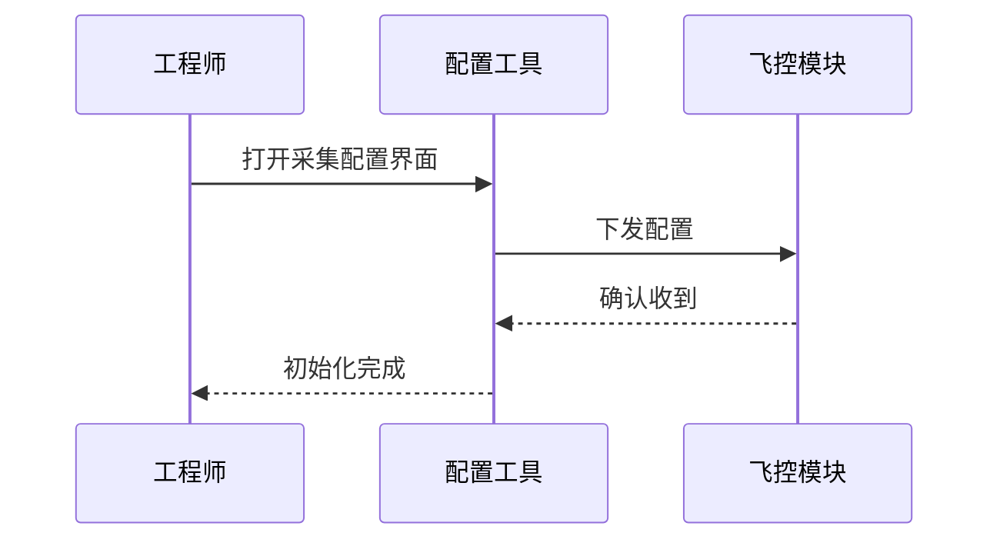
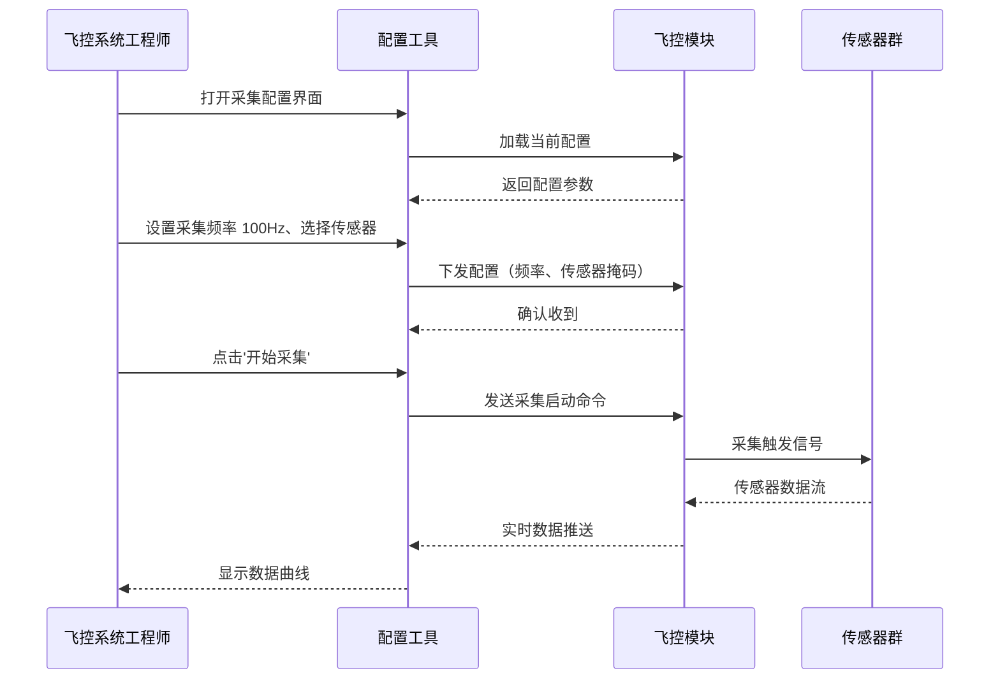

# /structurize-req 命令

## 概述

将自然语言需求文本转换为结构化需求卡片（JSON），并以 Markdown 格式输出。

支持单条和批量处理（5-10 条/批），一次调用完成需求结构化。所有生成的卡片均遵循统一的 JSON Schema，包括需求编号、优先级、用户场景、验收标准、时序图等关键字段，确保需求质量和可追溯性。

---

## 使用方法

### 单条需求

直接将需求文本作为参数，系统自动结构化并输出 Markdown 格式卡片：

```
/structurize-req 飞控系统需要采集传感器数据，采样率 100Hz，误差不超过 1%。支持 256 并发连接，响应时间不超过 200ms。
```

典型输出（见"输出示例"章节）包含需求编号、优先级、用户场景、交互流程（Mermaid 时序图）、验收标准等。

### 批量需求（从 Markdown 文件）

读取包含多个需求的 Markdown 文件，自动拆分并一次性处理：

```
/structurize-req --file hd-docs/requirements.md
```

系统自动识别以下分隔符：
- Markdown H3 标题（### 需求 xxx）
- 数字列表（1. xxx、2. xxx）
- 空行分隔（段落间空行）

### 指定批次大小

当需求数量较多时，可通过 `--batch` 参数控制每批处理数量：

```
/structurize-req --file hd-docs/requirements.md --batch 10
```

建议批次大小 5-10 条，一次调用返回完整的卡片集合。

### 指定输出目录

自定义输出目录（默认为 `.opencode/requirements/`）：

```
/structurize-req --file hd-docs/requirements.md --output .opencode/requirements/
```

- 单条模式：输出到控制台并可选保存为 `REQ-YYYY-MM-NNN.md`
- 批量模式：每个卡片保存为独立文件（`REQ-YYYY-MM-001.md` 等）

---

## 处理流程

### 1. 输入检测

命令系统检测输入类型，决定处理路径：

- **单条文本模式：** 直接接收命令行参数中的需求文本，无需额外处理
- **文件模式（--file）：** 读取指定文件内容，自动识别需求分隔符

**检测逻辑：**
- 若包含 `--file` 参数，进入文件模式
- 否则，将所有参数拼接视为单条需求文本
- 若未提供任何输入，返回错误提示

### 2. 需求拆分（批量模式）

文件模式下，系统依次尝试识别以下 3 种分隔符，将文件拆分为多个需求：

**格式 A：Markdown H3 标题分隔**
```markdown
### 需求 1：飞控数据采集
需求描述详细内容...

### 需求 2：电源管理初始化
需求描述详细内容...
```

优先级最高。每个 H3 标题及其下方内容（直到下一个 H3 或文件末尾）作为一个需求。

**格式 B：数字列表分隔**
```
1. 飞控数据采集
   需求描述详细内容...
   可跨多行

2. 电源管理初始化
   需求描述详细内容...
```

当文件中不存在 H3 标题时尝试此格式。每个编号项及其缩进内容作为一个需求。

**格式 C：空行分隔**
```
需求 1：飞控数据采集
需求描述详细内容...

需求 2：电源管理初始化
需求描述详细内容...
```

当以上格式均失效时，按空行（连续换行符）拆分文件。每个非空白段落作为一个需求。

**容错机制：** 若所有分隔符识别均失败，将整个文件内容作为单条需求处理。

### 3. SKILL 加载

加载 `.opencode/skills/req-structuring/SKILL.md` 文件，提供：

- **JSON Schema 定义** — 需求卡片的完整字段约束（req_id、name、priority、objective、user_scenario、sequence_diagram、acceptance_criteria 等）
- **字段生成规范** — 每个字段的格式、约束、推荐算法（如优先级推荐规则、时序图编写示例、验收标准 BDD 格式）
- **编号生成规则** — REQ-YYYY-MM-NNN 格式的自动递增规则
- **批处理指令** — 5-10 条需求批量处理时的流程

SKILL 内容将作为 LLM 的上下文参考，确保生成结果符合统一规范。

### 4. LLM 调用

组织 3 段 prompt，调用本地 LLM（Qwen3.5 30B INT8 或配置的其他模型）：

**段 1：系统提示（System Prompt）**
```
你是需求结构化专家。你的任务是将自然语言需求转换为标准化的 JSON 格式需求卡片。

生成的卡片应满足以下特性：
- 编号规范：REQ-YYYY-MM-NNN 自动递增（示例：REQ-2026-03-001、REQ-2026-03-002）
- 优先级准确推荐：P0（关键路径）/ P1（重要特性）/ P2（优化项）/ P3（低优先级）
- 时序图完整有效：Mermaid 格式，必须包含参与者、消息、返回
- 验收标准清晰可测：BDD 格式（Given...When...Then），至少 3 条
- 用户场景四要素：role（角色）/ precondition（前置条件）/ steps（操作步骤）/ expected_result（预期结果）
```

**段 2：SKILL 上下文（Context）**

（插入 `req-structuring/SKILL.md` 的完整内容，包括 JSON Schema、字段详细说明、生成规范示例）

**段 3：用户输入（User Request）**
```
请结构化以下需求：

[需求文本内容]
```

整个 3 段 prompt 合并后发送给 LLM，触发生成流程。

### 5. StructuredOutput 工具调用

使用 opencode 原生 **StructuredOutput** 工具，指定 JSON Schema 约束：

```
input: <user_request>
tools:
  - type: StructuredOutput
    schema: <requirement_card_schema>  # 来自 SKILL.md
output: JSON array (单条或批量)
```

StructuredOutput 工具确保：
- LLM 输出严格遵循 JSON Schema
- 自动校验字段类型、长度、枚举值
- 若校验失败，自动触发重试（最多 3 次）
- 返回有效的 JSON 数组或对象

**关键字段校验：**
- `req_id`: 正则 `^REQ-\d{4}-\d{2}-\d{3}$` 格式
- `name`: 字符串，1-30 字
- `priority`: 枚举 P0/P1/P2/P3
- `user_scenario.steps`: 至少 2 个步骤
- `acceptance_criteria`: 至少 3 条验收标准

### 6. 后处理（JSON → Markdown）

将 LLM 生成的 JSON 转换为可读的 Markdown 格式，便于版本管理和人工审查：

**输入（JSON 示例）：**
```json
{
  "req_id": "REQ-2026-03-001",
  "name": "飞控数据采集接口",
  "author": "张工",
  "priority": "P0",
  "status": "草稿",
  "objective": "实现实时飞控数据采集，支持 100Hz 采样率，误差 ≤1%，支持 256 并发连接，响应时间 ≤200ms。",
  "user_scenario": {
    "role": "飞控工程师",
    "precondition": "系统已启动，传感器已连接且初始化完毕，当前处于待命状态。",
    "steps": [
      "打开飞控配置工具",
      "选择'数据采集'菜单，进入采集参数配置界面",
      "设置采集频率为 100Hz，选择要采集的传感器（加速度计、陀螺仪）",
      "点击'开始采集'按钮，系统开始采集数据"
    ],
    "expected_result": "系统进入采集状态，显示'采集中...'，实时数据曲线以 ≥100Hz 频率更新，采集数据写入本地缓存和 CAN 总线。"
  },
  "sequence_diagram": "sequenceDiagram\n  participant 工程师\n  participant 配置工具\n  participant 飞控模块\n  工程师->>配置工具: 打开采集配置界面\n  配置工具->>飞控模块: 下发配置\n  飞控模块-->>配置工具: 确认收到\n  配置工具-->>工程师: 初始化完成",
  "acceptance_criteria": [
    "Given 采样率设为 100Hz，When 采集 1 秒数据，Then 返回 100 个数据点",
    "Given 缓冲区容量为 10000，When 请求继续采集，Then 返回溢出错误",
    "Given 传感器已断开，When 调用 Collect()，Then 返回断开异常"
  ],
  "constraints": "单次请求响应时间 ≤200ms，最多 256 并发连接，传感器故障时 50ms 内返回错误。",
  "interface_def": "class DataCollector { bool Start(float sample_rate_hz); std::vector<DataPoint> Collect(uint32_t count); };"
}
```

**输出（Markdown 格式）：**
```markdown
## 需求卡片：REQ-2026-03-001

| 字段 | 内容 |
|------|------|
| 需求名称 | 飞控数据采集接口 |
| 提出人 | 张工 |
| 优先级 | P0 |
| 状态 | 草稿 |
| 功能目标 | 实现实时飞控数据采集，支持 100Hz 采样率，误差 ≤1%，支持 256 并发连接，响应时间 ≤200ms。 |

### 用户场景

| 要素 | 描述 |
|------|------|
| 角色 | 飞控工程师 |
| 前置条件 | 系统已启动，传感器已连接且初始化完毕，当前处于待命状态。 |
| 操作步骤 | 1. 打开飞控配置工具<br/>2. 选择'数据采集'菜单，进入采集参数配置界面<br/>3. 设置采集频率为 100Hz，选择要采集的传感器<br/>4. 点击'开始采集'按钮，系统开始采集数据 |
| 预期结果 | 系统进入采集状态，显示'采集中...'，实时数据曲线以 ≥100Hz 频率更新，采集数据写入本地缓存和 CAN 总线。 |

### 交互流程



### 验收标准

- [ ] Given 采样率设为 100Hz，When 采集 1 秒数据，Then 返回 100 个数据点
- [ ] Given 缓冲区容量为 10000，When 请求继续采集，Then 返回溢出错误
- [ ] Given 传感器已断开，When 调用 Collect()，Then 返回断开异常

### 约束条件

单次请求响应时间 ≤200ms，最多 256 并发连接，传感器故障时 50ms 内返回错误。

### 接口定义

```cpp
class DataCollector {
 public:
  bool Start(float sample_rate_hz);
  std::vector<DataPoint> Collect(uint32_t count);
};
```
```

后处理过程中：
- 表格字段按固定顺序排列（req_id → name → author → priority → status → objective）
- 时序图的转义符（\n）还原为真实换行，嵌入 Mermaid 代码块
- 步骤列表使用 Markdown 有序列表或 HTML 换行符
- 验收标准使用 checkbox 列表格式（便于人工审核时勾选）

### 7. 文件保存

**单条模式：**
- 输出到控制台（标准输出）
- 可选保存到文件：`.opencode/requirements/REQ-YYYY-MM-NNN.md`

**批量模式：**
- 每个卡片保存为独立文件：`.opencode/requirements/REQ-YYYY-MM-001.md`、`REQ-YYYY-MM-002.md` 等
- 自动创建输出目录（若不存在）
- 若文件已存在，提示用户确认覆盖或追加编号

**文件命名规则：**
- 使用卡片的 `req_id` 作为文件名
- 扩展名统一为 `.md`
- 示例：`REQ-2026-03-001.md`、`REQ-2026-03-015.md`

### 8. 错误处理

系统设计完善的错误处理机制，确保即使部分失败也能提供有用的反馈：

| 错误场景 | 触发条件 | 处理方式 |
|---------|---------|---------|
| 文件不存在 | `--file` 指定的路径不存在 | 输出 `Error: File not found: <path>` 并中止 |
| 文件为空 | 指定的文件无内容或仅包含空白 | 输出 `Warning: File is empty, nothing to process` |
| 分隔符识别失败 | 未识别到 H3 标题、数字列表或空行 | 按整个文件作为单条需求处理，继续流程 |
| LLM 生成失败 | LLM 服务不可用或超时 | 输出 `Error: LLM call failed. Details: <error message>` |
| 单项生成失败（批量） | 某一条需求的 LLM 调用或校验失败 | 记录失败项（含原因），继续处理后续需求 |
| Schema 校验失败 | JSON 输出不符合 Schema 约束 | 输出 `Error: Generated JSON doesn't match schema. Details: <validation error>`，触发重试（最多 3 次） |
| 权限问题 | 无法写入输出目录 | 输出 `Error: Permission denied writing to <directory>` |

**批量模式的容错机制：**
- 若某一条需求处理失败，不影响其他需求
- 最终输出包含：成功条目列表 + 失败条目清单（含原因）
- 支持用户重新处理失败项或跳过

### 9. 进度报告

在命令执行过程中，系统输出结构化的进度信息，便于用户追踪和调试：

**单条模式进度示例：**
```
> /structurize-req 飞控数据采集接口

✓ 检测到单条需求模式
✓ SKILL 加载完成（req-structuring/SKILL.md）
✓ LLM 调用中...（预计 10-30 秒）
✓ 生成卡片：REQ-2026-03-001
✓ 后处理：JSON → Markdown
✓ 耗时：12.5 秒

## 需求卡片：REQ-2026-03-001
[卡片内容...]
```

**批量模式进度示例：**
```
> /structurize-req --file hd-docs/requirements.md

✓ 读取文件：hd-docs/requirements.md（2.3 KB）
✓ 识别分隔符：H3 标题分隔
✓ 拆分需求：5 条（批次大小 5）
✓ SKILL 加载完成

✓ 处理进度：[████████░░] 4/5（80%）
  - REQ-2026-03-001：飞控数据采集 ✓ (12.3s)
  - REQ-2026-03-002：电源管理初始化 ✓ (9.8s)
  - REQ-2026-03-003：传感器故障诊断 ✓ (11.5s)
  - REQ-2026-03-004：系统日志记录 ✓ (10.2s)
  - REQ-2026-03-005：数据备份恢复... (进行中)

✗ 失败项（1 条）：
  - REQ-2026-03-005：缺少明确的交互流程描述（需要在原始需求中补充参与者和消息）

✓ 已保存到 .opencode/requirements/
  - REQ-2026-03-001.md (1.2 KB)
  - REQ-2026-03-002.md (1.1 KB)
  - REQ-2026-03-003.md (1.3 KB)
  - REQ-2026-03-004.md (1.0 KB)

✓ 总耗时：54.8 秒（平均 10.96 秒/条）
✓ 处理成功：4/5（80% 成功率）
```

进度报告中的时间数据便于性能监控，失败原因帮助用户改进输入质量。

---

## 输出示例

### 单条需求

**命令：**
```
/structurize-req 飞控系统需要采集传感器数据，采样率 100Hz，误差不超过 1%。支持 256 并发连接，响应时间不超过 200ms。
```

**输出：**
```
✓ 处理单条需求
✓ 生成卡片：REQ-2026-03-001
✓ 耗时：12.5 秒

## 需求卡片：REQ-2026-03-001

| 字段 | 内容 |
|------|------|
| 需求名称 | 飞控数据采集接口 |
| 提出人 | 系统生成 |
| 优先级 | P0 |
| 状态 | 草稿 |
| 功能目标 | 实现实时飞控数据采集，支持 100Hz 采样率，误差 ≤1%，支持 256 并发连接，响应时间 ≤200ms。 |

### 用户场景

| 要素 | 描述 |
|------|------|
| 角色 | 飞控系统工程师 |
| 前置条件 | 系统已启动，传感器已连接且初始化完毕，当前处于待命状态。 |
| 操作步骤 | 1. 打开飞控配置工具<br/>2. 进入数据采集配置界面<br/>3. 设置采集频率为 100Hz，选择采集的传感器<br/>4. 点击'开始采集'按钮 |
| 预期结果 | 系统进入采集状态，实时数据曲线以 ≥100Hz 频率更新，采集数据写入本地缓存。 |

### 交互流程



### 验收标准

- [ ] Given 采样率设为 100Hz，When 采集 1 秒数据，Then 返回 100 个数据点
- [ ] Given 缓冲区容量为 10000，When 请求继续采集，Then 返回溢出错误提示
- [ ] Given 传感器已断开，When 调用采集方法，Then 返回"传感器断开"异常
- [ ] Given 系统支持 256 并发连接，When 同时发起 256 个采集请求，Then 全部返回成功且耗时 ≤200ms

### 约束条件

- 单次请求响应时间 ≤200ms
- 支持 256 个并发连接
- 采样精度误差 ≤1%
- 采集数据应包含精确的时间戳（微秒级）

### 接口定义

```cpp
struct DataPoint {
  uint64_t timestamp_us;  // 微秒级时间戳
  float value;            // 传感器值
};

class DataCollector {
 public:
  // 启动采集，指定采样率（Hz）
  bool Start(float sample_rate_hz);

  // 采集指定数量的数据点
  std::vector<DataPoint> Collect(uint32_t count);

  // 停止采集
  void Stop();
};
```
```

### 批量需求

**命令：**
```
/structurize-req --file hd-docs/requirements.md --output .opencode/requirements/
```

**输出：**
```
✓ 读取文件：hd-docs/requirements.md
✓ 识别 5 条需求（H3 分隔）
✓ 生成进度：[████████░░] 4/5

✓ 已完成：REQ-2026-03-001, REQ-2026-03-002, REQ-2026-03-003, REQ-2026-03-004
✗ 失败：REQ-2026-03-005 (原因：缺少明确的时序图描述)

✓ 已保存到 .opencode/requirements/
✓ 总耗时：48.3 秒 (平均 9.7 秒/条)
```

执行完成后，生成 4 个 Markdown 文件：
- `.opencode/requirements/REQ-2026-03-001.md`
- `.opencode/requirements/REQ-2026-03-002.md`
- `.opencode/requirements/REQ-2026-03-003.md`
- `.opencode/requirements/REQ-2026-03-004.md`

用户可查看失败原因，手动补充 REQ-2026-03-005 的需求描述后重新处理。

---

## 常见问题

### Q1: 时序图生成错误或为空怎么办？

**现象：** 生成的卡片中时序图部分为空或语法错误。

**原因：** 需求文本中缺少足够的交互信息（参与者、消息流程）。

**解决方案：**
- ❌ 不清晰的输入："系统应该快速响应"（缺少交互细节）
- ✓ 改进后："用户在配置工具中输入采集频率，配置工具下发参数给飞控模块，飞控模块返回确认，采集开始"

**建议：** 在输入需求时明确描述参与者（用户、系统、模块等）和它们之间的消息交互，时序图生成成功率会大幅提高。

### Q2: 验收标准生成数量太少或太多怎么办？

**现象：** 生成的验收标准只有 3 条（最小值），或超过 8 条显得冗余。

**理由：** Schema 约束验收标准至少 3 条，但建议 3-8 条为最佳范围。

**解决方案：**
- 若标准 ≤3 条且不清晰，可手动增补至 5-8 条，格式为 BDD 风格（Given...When...Then）
- 若标准 >8 条，考虑拆分需求。示例：
  - 原需求："数据采集系统"（涵盖采集、存储、恢复等 10+ 标准）
  - 拆分后：
    - 需求 1："数据采集模块"（4 个标准）
    - 需求 2："数据存储和备份"（3 个标准）
    - 需求 3："数据恢复"（3 个标准）

### Q3: 能否修改已生成的卡片？

**答案：** 完全可以。生成的卡片为 Markdown 文件，支持：

- **手动编辑：** 在任何文本编辑器中直接修改
- **版本控制：** 使用 git 追踪变更历史，查看修改对比
- **字段修改建议：**
  - `priority`：若推荐不准确，改为正确的优先级（P0/P1/P2/P3）并记录理由
  - `user_scenario`：补充或调整操作步骤和预期结果
  - `acceptance_criteria`：增加或细化验收标准
  - `interface_def`：补充或更新接口定义

**最佳实践：** 在卡片中用注释记录修改理由，便于后续审查和追踪需求演进。

### Q4: 优先级推荐不准确怎么办？

**原因：** AI 优先级推荐基于关键词匹配，复杂的业务逻辑可能导致推荐偏差。

**推荐规则（仅供参考）：**
- **P0（关键路径）：** 包含"必须"、"必需"、"关键"、"核心"、"不可或缺"等词语的需求
- **P1（重要特性）：** 包含"应该"、"应当"、"优先"、"重要"等词语的需求
- **P2（优化项）：** 包含"可以"、"可选"、"改进"、"增强"等词语的需求
- **P3（低优先级）：** 其他需求

**调整方法：**
- LLM 生成后，用户应根据实际业务价值手动调整
- 在 Markdown 文件中修改 `priority` 字段值即可
- 建议记录调整理由（注释或单独文档）

### Q5: 批量处理中某条需求失败，如何重新处理？

**场景：** 处理 10 条需求时，REQ-2026-03-005 失败，其他 9 条成功。

**处理步骤：**
1. 查看失败原因（命令输出中的错误描述）
2. 修改原始需求文本（`hd-docs/requirements.md`），补充缺失信息
3. 重新执行命令：
   ```
   /structurize-req --file hd-docs/requirements.md --output .opencode/requirements/
   ```
4. 系统会提示覆盖已存在的文件，确认覆盖（或指定新的输出目录）

**避免重复处理已成功的需求：** 也可通过编辑命令，仅处理失败的需求文本（单条模式），然后手动添加到 `.opencode/requirements/` 目录。

---

## 性能指标

本命令的性能目标和实际表现：

| 指标 | 目标 | 说明 |
|------|------|------|
| 单条需求处理时间 | ≤30 秒 | 依赖本地 LLM 推理速度（Qwen3.5 30B INT8 配置） |
| 批量处理吞吐量 | 5-10 条/批 | 一次调用处理 5-10 条需求，返回完整卡片集合 |
| 准确率 | ≥80% | 基于 20+ 条需求的人工评分，评分维度包括字段完整性、优先级合理性、验收标准清晰度、时序图有效性、用户场景完整性 |
| 批量处理平均耗时 | 9-11 秒/条 | 典型场景：5 条需求，总耗时 50-60 秒，平均每条 10-12 秒 |
| 文件 I/O 开销 | <5% | 相对于 LLM 推理时间，文件读写和后处理的开销可忽略 |
| 输出文件大小 | 1.0-1.5 KB/条 | 单个需求卡片的 Markdown 文件大小通常在 1-1.5 KB |

**性能提升建议：**
- 使用更强大的 LLM 模型（如 Qwen3.5 70B），可在同等时间内提高准确率
- 批量处理优于单条处理（并行 LLM 调用可进一步加速）
- 优化输入需求文本质量（信息完整、结构清晰），可减少 LLM 的重试次数

---

## 后续步骤

### 输出作为下游任务的输入

生成的需求卡片是后续开发任务的重要输入源：

1. **项目管理和版本控制**
   - 所有卡片纳入版本控制（git），便于需求演进追踪
   - 可导入项目管理工具（JIRA、Notion、Tapd 等），关联任务和阶段
   - 客户确认并更新 `status` 字段（"草稿" → "已确认" → "开发中" → "已完成"）

2. **C++ 单元测试生成（E2 流程）**
   - 可选将需求卡片导入 `/gen-test` 命令（E2 测试生成）
   - 测试生成将基于验收标准生成对应的 gtest 或 CppUnit 单元测试
   - 流程：需求卡片 → 测试框架 → C++ 测试代码

3. **详细设计和接口开发**
   - `interface_def` 字段可作为开发人员的接口参考
   - 结合 `user_scenario` 和 `sequence_diagram`，支持进一步的设计深化
   - 生成 API 文档或接口规范（OpenAPI、Protobuf 等）

4. **需求评审和客户确认**
   - 将卡片以 Markdown 或 HTML 形式呈现给客户
   - 客户审阅并提供反馈（通过 git PR、注释或邮件）
   - 根据反馈调整卡片，完成迭代确认

---

**文档版本：** 1.0
**最后更新：** 2026-03-31
**作者：** opencode 航电定制项目 (E1 需求理解 Epic)
**适用范围：** .opencode 项目级扩展，不修改 opencode 核心源码
