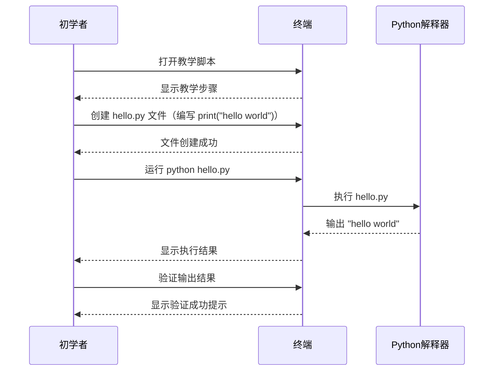

## 需求卡片：REQ-2026-04-001

| 字段   | 内容                        |
| ------ | --------------------------- |
| 编号   | REQ-2026-04-001             |
| 名称   | Python Hello World 教学脚本 |
| 提出人 | 待指定                      |
| 优先级 | P1（重要）                  |
| 状态   | 草稿                        |

### 功能目标

创建一个带有教学功能的 Python 入门脚本，通过详细的步骤指导，帮助编程初学者掌握如何编写并运行一个输出 "hello world" 的程序，让用户在实践过程中理解 Python 基本语法和脚本运行方式。

### 用户场景

**角色：** 编程初学者

**前置条件：** 用户已安装 Python 环境（3.x 版本），命令行终端可用。

**操作步骤：**

1. 初学者打开教学脚本
2. 按照脚本提示创建 hello.py 文件
3. 在终端运行 Python 脚本
4. 验证终端输出结果

**预期结果：** 成功在终端输出 "hello world"，初学者理解 Python 基本语法和运行流程。

### 交互流程

### 验收标准

1. **Given** 初学者已安装 Python 3.x 环境 **When** 打开教学脚本 **Then** 脚本显示欢迎信息和操作步骤指引

2. **Given** 初学者按照脚本指引创建 hello.py 文件 **When** 文件内容包含 print("hello world") **Then** 文件成功创建，无语法错误

3. **Given** hello.py 文件已创建 **When** 在终端运行 python hello.py **Then** 终端成功输出 "hello world"

4. **Given** 脚本运行成功 **When** 初学者完成全部操作 **Then** 脚本显示完成祝贺和下一步学习建议

### 约束条件

- 脚本需兼容 Python 3.6 及以上版本
- 教学步骤应简洁清晰，适合零基础用户理解
- 脚本应提供错误处理和友好提示
